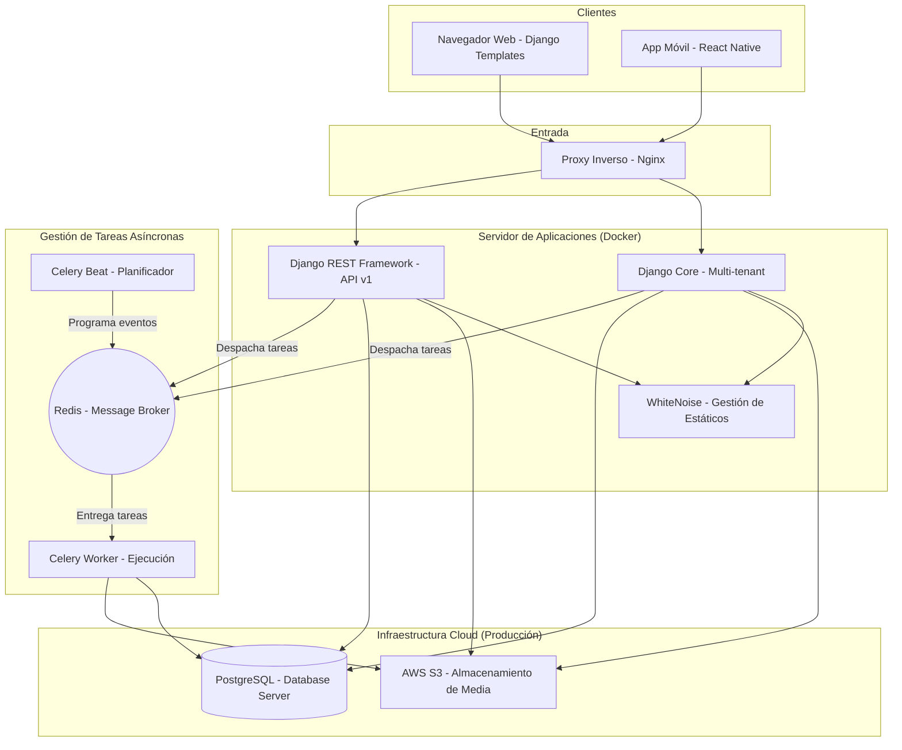

```mermaid
graph TD
    subgraph Clientes
        Web[Navegador Web - Django Templates]
        Mobile[App Móvil - React Native]
    end

    subgraph Entrada
        Nginx[Proxy Inverso - Nginx]
    end

    subgraph "Servidor de Aplicaciones (Docker)"
        Django[Django Core - Multi-tenant]
        API[Django REST Framework - API v1]
        Static[WhiteNoise - Gestión de Estáticos]
    end

    subgraph "Infraestructura Cloud (Producción)"
        S3[AWS S3 - Almacenamiento de Media]
        RDS[(PostgreSQL - Database Server)]
    end

    subgraph "Gestión de Tareas Asíncronas"
        Redis((Redis - Message Broker))
        Worker[Celery Worker - Ejecución]
        Beat[Celery Beat - Planificador]
    end

    %% Flujos de Red y Acceso
    Web & Mobile --> Nginx
    Nginx --> Django & API
    
    %% Flujos de Almacenamiento y Datos
    Django & API --> Static
    Django & API --> S3
    Django & API --> RDS

    %% Flujos de Celery (Lógica real de colas)
    Django & API -- "Despacha tareas" --> Redis
    Beat -- "Programa eventos" --> Redis
    Redis -- "Entrega tareas" --> Worker
    Worker --> RDS
    Worker --> S3
```